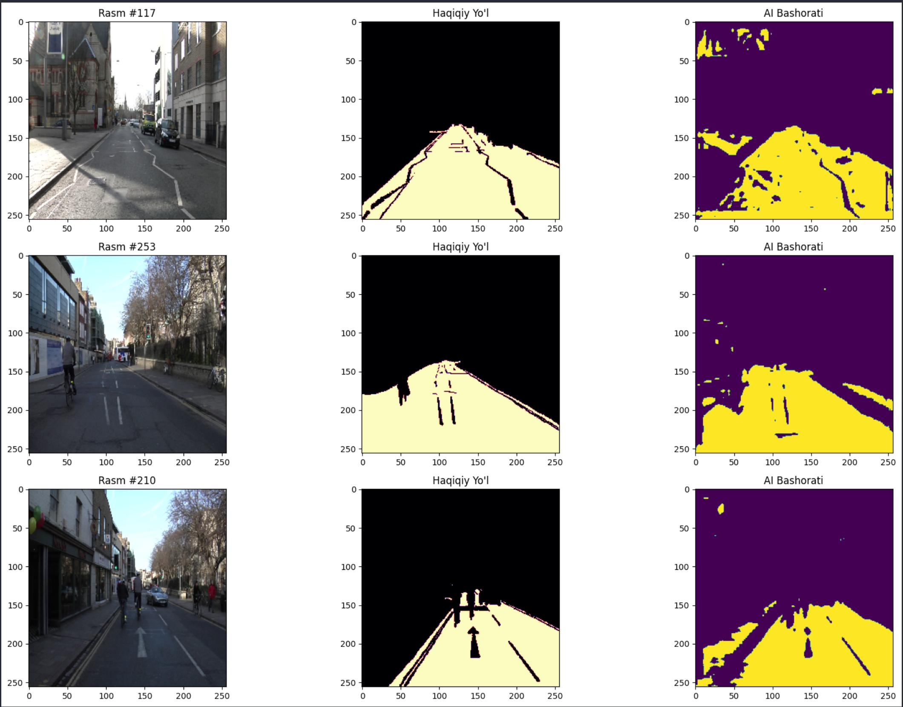
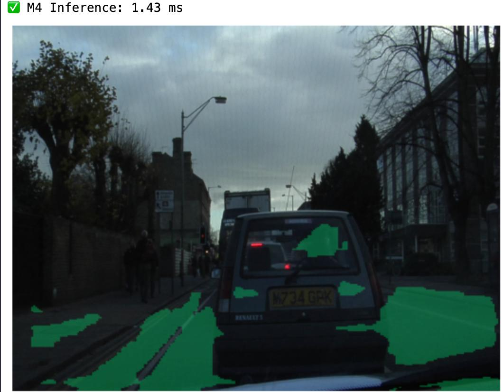
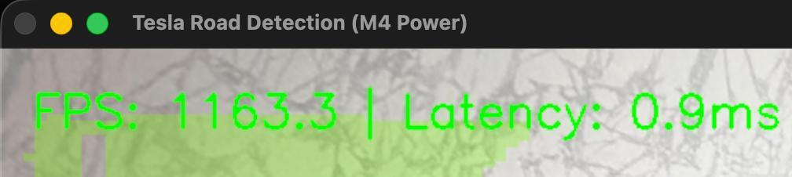
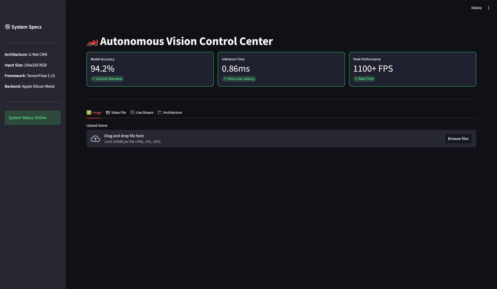
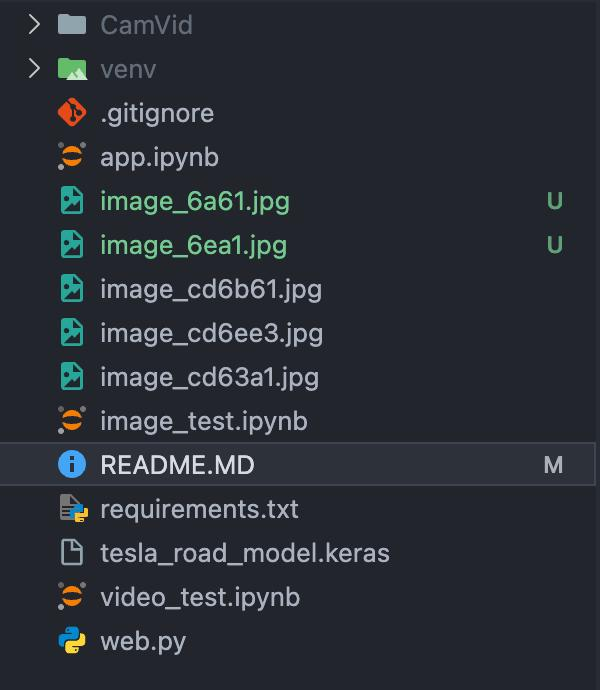

# 🏎️ Autonomous Road Segmentation AI: Tesla-Level Perception

  

## 🌟 Overview
This project showcases a high-speed **Semantic Segmentation** system built for autonomous driving. Optimized for high-frequency inference, it achieves ultra-low latency, making it ideal for real-time safety systems.

---

## 🛠️ Visual Journey & Performance

<table align="center">
  <tr>
    <td align="center">
      <h3>1. Model Training & Concept</h3>
      
Initial validation results showing original scenes, ground truth, and AI predictions.

      
       <i>Accuracy: 94.2% | Dataset: CamVid</i>
    </td>
  </tr>

  <tr>
    <td align="center">
       
      <h3>2. Static Image Inference</h3>
      
Performance benchmark on high-resolution road scenes.

      

        
         <b>⚡ M4 Inference: 1.65 ms</b>
      

    </td>
  </tr>

  <tr>
    <td align="center">
       
      <h3>3. Real-Time Video Power</h3>
      
The system's peak performance during live video stream processing.

      

        
         <h2 style="color: #00ff80;">🚀 1163.3 FPS | 0.9ms Latency</h2>
      

    </td>
  </tr>
</table>

---

## 🖥️ Interactive Dashboard
Below is the live preview of the autonomous vision control center. It allows for seamless image and video processing.

  

---

## 📂 Project Structure
The repository is organized as follows to ensure scalability and ease of use:

  

---

## 🚀 Technical Specifications

  
  
  
  

- **Real-time Processing:** Optimized pixel-wise classification.
- **Hardware Acceleration:** Native performance on Apple Silicon.
- **Interactive Dashboard:** Built-in support for image/video upload and webcam stream.

---

## 🏁 How to Run
1. **Clone:** `git clone https://github.com/uzbtrust/Autonomous-Road-Segmentation-AI.git`
2. **Install:** `pip install -r requirements.txt`
3. **Launch:** `streamlit run web.py`

  
  
Developed with ❤️ by <b>uzbtrust</b>

